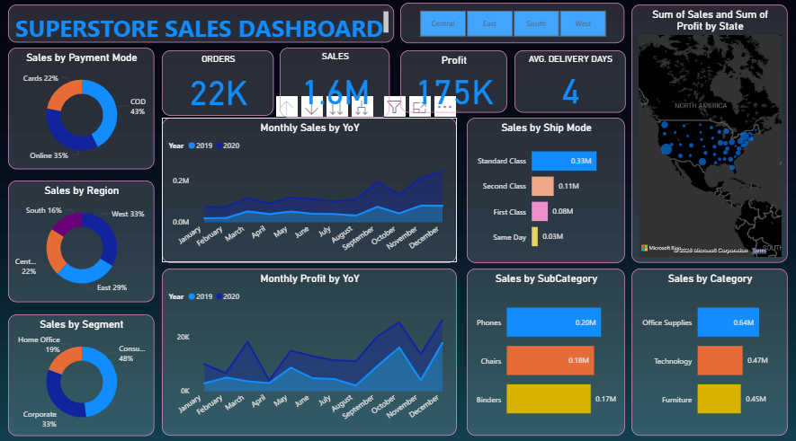
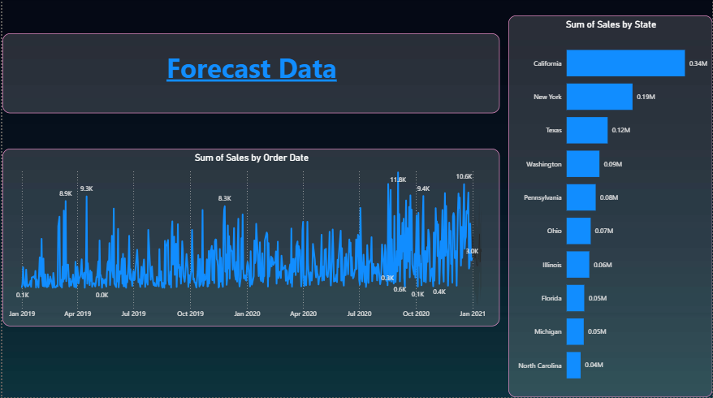

# 📊 Power BI Superstore Sales & Forecast Dashboard

## Project Overview  
This project is an interactive **Power BI dashboard** built to analyze **Superstore sales performance** and provide **forecast insights** based on historical data.

The dashboard helps stakeholders understand **sales trends, profitability, customer behavior, shipping performance, and regional contribution**, along with a separate **forecast view** for future sales patterns.

---

## Objectives  
The main objectives of this project are:

- To track overall **sales, profit, and orders**
- To analyze **monthly sales and profit trends (YoY)**
- To evaluate performance by **region, state, and segment**
- To understand customer behavior by **payment mode**
- To analyze sales by **category and sub-category**
- To monitor **shipping performance**
- To generate **sales forecast using historical data**

---

## Dashboard Views  

### 1. Superstore Sales Dashboard  
This view provides a complete overview of business performance using key KPIs and visual analytics.

#### Key Performance Indicators (KPIs)
- **Orders** – Total number of orders  
- **Sales** – Total revenue generated  
- **Profit** – Total profit  
- **Avg. Delivery Days** – Average delivery time  

#### Visual Analytics
- Sales by Payment Mode (Donut Chart)  
- Sales by Region (Donut Chart)  
- Sales by Segment (Donut Chart)  
- Monthly Sales by YoY (Line Chart)  
- Monthly Profit by YoY (Line Chart)  
- Sales by Ship Mode (Bar Chart)  
- Sales by Category (Bar Chart)  
- Sales by Sub-Category (Bar Chart)  
- Sales and Profit by State (Map Visual)  

---

### 2. Forecast Dashboard  
This view focuses on **time-series analysis and forecasting**.

Key components:
- Line chart showing **sales trend by order date**
- Bar chart showing **top states by sales**
- Historical pattern used to **predict future sales behavior**

This view supports **strategic planning and demand forecasting**.

---

## Key Features  

- Interactive region slicers (Central, East, South, West)  
- KPI-based executive reporting  
- Year-over-Year trend comparison  
- Regional and state-wise analysis  
- Category and sub-category insights  
- Shipping performance monitoring  
- Forecast analysis using time series  

---

## Business Use Cases  

This dashboard can be used for:

- Executive sales reporting  
- Revenue and profit analysis  
- Market and regional performance tracking  
- Inventory and demand planning  
- Logistics and delivery optimization  
- Strategic sales forecasting  

---

## Tools & Technologies  

- **Power BI Desktop**
- **DAX (Data Analysis Expressions)**
- **Power Query (ETL)**
- Data modeling and relationships  
- Time series analysis and forecasting  
- Interactive visual analytics  

---

## Data Model  

The dataset includes the following key fields:

- `Order_Date`  
- `Region`  
- `State`  
- `Segment`  
- `Category`  
- `Sub_Category`  
- `Ship_Mode`  
- `Payment_Mode`  
- `Sales`  
- `Profit`  
- `Order_ID`  

---

## Key Learnings  

Through this project, I gained hands-on experience in:

- Building multi-page business dashboards  
- Implementing forecasting models in Power BI  
- Performing YoY trend analysis  
- Designing executive KPI reports  
- Creating region-wise and category-wise insights  
- Applying data storytelling techniques  

---

## Future Enhancements  

- Add MoM growth analysis  
- Implement profit margin KPIs  
- Add product-level forecasting  
- Include customer lifetime value (CLV)  
- Publish to Power BI Service  

---

## Author  

**Mohammad Sayam Fareez**  
Aspiring Data Analyst | Power BI Developer  
Electronics Engineering Graduate (2025)

